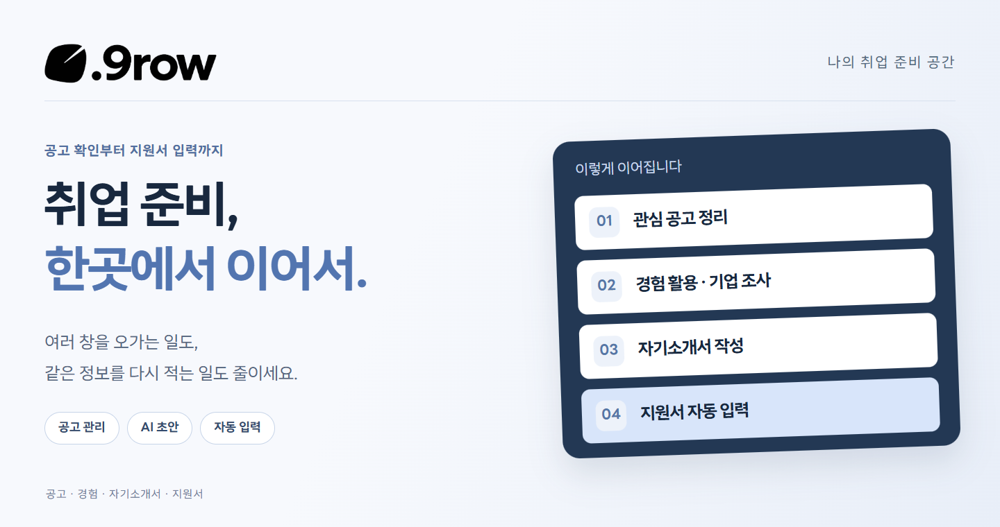

<picture>
  <source media="(max-width: 640px)" srcset="docs/readme-assets/2026-10-08-v06/cover-mobile.png" />
  
</picture>

  <a href="#시연-영상"><b>시연 영상</b></a> &nbsp; / &nbsp;
  <a href="#핵심-기능"><b>핵심 기능</b></a> &nbsp; / &nbsp;
  <a href="#사용-흐름"><b>사용 흐름</b></a>

 

**공고는 채용사이트에, 경험은 메모에, 자소서는 또 다른 창에.** 
.9row는 흩어진 취업 준비를 한곳에 모읍니다. 공고와 경험을 바탕으로 기업 조사와 자기소개서 초안을 만들고, 저장한 기본 정보는 크롬 확장 프로그램으로 실제 지원서에 입력합니다.

 

## 시연 영상

### 같은 학력 정보, 다시 복사하지 않아도.

저장한 학력 정보를 선택하면 지원서의 학교·재학기간·전공·학점 항목이 차례로 채워집니다.

https://github.com/user-attachments/assets/83689b78-1c41-4d91-8766-561fee88e403

  <a href="https://github.com/user-attachments/assets/83689b78-1c41-4d91-8766-561fee88e403"><b>▶ 약 26초로 보는 실제 작동 모습</b></a> 
  저장한 정보 선택 → 입력란 확인 → 자동 입력 → 결과 확인

 

## 핵심 기능

<table>
  <tr>
    <td width="50%" valign="top">
      <h3>01 &nbsp; 관심 공고</h3>
      
<b>필요한 공고를 한곳에.</b>

      
공고 링크로 내용을 정리하고 보관합니다. 지원할 때는 원래 채용사이트로 바로 이동합니다.

    </td>
    <td width="50%" valign="top">
      <h3>02 &nbsp; 경험 관리</h3>
      
<b>내 경험을 다시 설명하지 않도록.</b>

      
자기소개서에 활용할 경험을 미리 등록하고 관리합니다. 저장한 경험은 다음 작성에도 활용합니다.

    </td>
  </tr>
  <tr>
    <td width="50%" valign="top">
      <h3>03 &nbsp; 자기소개서</h3>
      
<b>기업 조사부터 초안까지.</b>

      
공고와 경험을 바탕으로 기업 조사와 초안 작성을 요청합니다. 작성된 글을 직접 확인하고 수정합니다.

    </td>
    <td width="50%" valign="top">
      <h3>04 &nbsp; 크롬 확장 프로그램</h3>
      
<b>저장한 정보를 실제 지원서로.</b>

      
웹사이트의 기본 정보를 불러와 지원서 입력을 돕습니다. 정보를 수정하면 이후 불러올 때 반영됩니다.

    </td>
  </tr>
</table>

 

## 사용 흐름

| 준비 | 작성 | 지원 |
| :--- | :--- | :--- |
| 관심 공고와 내 경험을 등록합니다. | 기업 조사와 초안을 요청하고 글을 다듬습니다. | 채용사이트로 이동해 기본 정보를 불러오고 입력 결과를 확인합니다. |

 

<b>시연 범위와 입력 결과 확인</b>

제공된 영상은 고등학교·대학교·주전공·복수전공 등의 **학력 자동 입력 시연**입니다. 마지막 화면에는 **21개 입력 · 1건 확인 필요**가 표시됩니다. 졸업구분의 반영 여부는 사이트에서 직접 확인하도록 안내하며, 최종 제출은 실행하지 않습니다.

지원 사이트의 양식에 따라 입력할 수 있는 항목은 달라집니다. 영상에는 웹사이트에서 수정한 정보를 다시 불러오는 과정이나 자격증·프로젝트 입력 장면은 포함되어 있지 않습니다.

<!-- Cover typography: LINE Seed KR, © LY Corporation, SIL Open Font License 1.1. https://seed.line.me/index_kr.html -->
